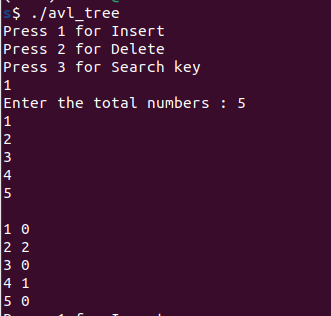
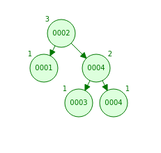

# Self Balancing Trees based Data Structures


Rebalancing trees, also known as self-balancing trees, are a type of data structure that automatically adjust their shape or structure to maintain a balanced state. These trees are designed to ensure efficient operations such as insertion, deletion, and searching by keeping the tree height balanced.

The primary purpose of rebalancing trees is to prevent degeneration into inefficient or degenerate cases that can occur in traditional binary search trees (BSTs). Without rebalancing, certain operations in BSTs, such as searching or inserting in a specific order, can lead to skewed or unbalanced trees, resulting in poor performance.

Rebalancing trees employ various algorithms and techniques to maintain balance. Some commonly used rebalancing tree data structuresm that are implemented in this repo are:

 - AVL Trees: AVL trees ensure balance by maintaining a height difference (balance factor) of at most 1 between the left and right subtrees of each node.

 - Red-Black Trees: Red-Black trees are binary search trees with additional coloring rules that ensure balance. They guarantee that no path from the root to a leaf is more than twice as long as any other path.

Rebalancing trees offer efficient operations with guaranteed worst-case time complexity, ensuring balanced performance in various scenarios. They are widely used in a range of applications, including databases, compilers, file systems, and more.


## Table of Contents

- [Requirements](#requirements)
- [Structure](#structure)
- [Usage](#usage)
- [Acknowledgements](#acknowledgements)


## Requirements

- C++
- Ubuntu

## Structure

There are two main folders each having code for a data structure,

- AVL Tree
- Red-Black Tree

Each folder has a make file that helps in compilation the code. The basic operations of a tree, such as insertion, deletion, search, inOrder display are implemented in this project.

## Usage

simply run the terminal and go to the directory that contains the AVL Tree downloaded code, and run the commands below:


```
$ make
$ ./avl_tree
```

Here are screenshots of an input sequence of length 5 numbers: 1, 2, 3, 4, 5. These numbers were given as input to an AVL tree, and the resulting tree is displayed in the CLI screenshot. The tree is printed in an in-order traversal manner. For reference, a tree was also generated using the same input on a [visualization website](https://www.cs.usfca.edu/~galles/visualization/AVLtree.html), and it can be observed that the tree generated by the code matches the expected tree structure. It is worth noting that the height values in the CLI output start from 0, while the reference visualization starts from 1.






For Red-Black tree, run the commands below:


```
$ make
$ ./red_black_tree
```


## Acknowledgement

This code was written by me in as a assignment of Data Structures course in National University of Computer and Emerging Sciences and it was written in the Eclipse IDE.

